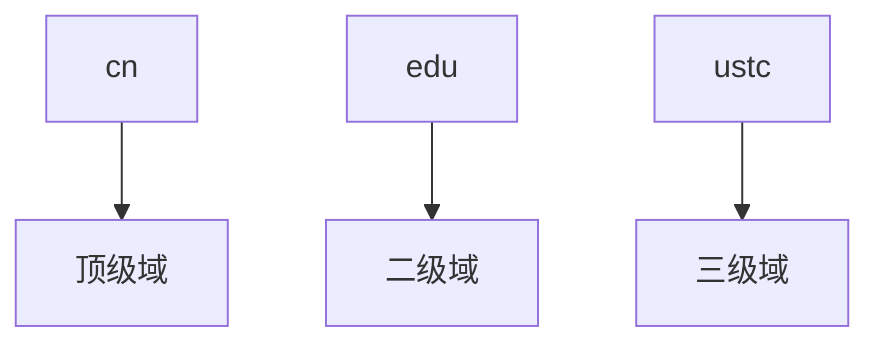

# DNS 笔记

## 概述

IP地址标识主机、路由器

但IP地址不好记忆，不便人类使用(没有意义)

* DNS的主要思路
  * 分层的、基于域的命名机制
  * 若干分布式的数据库完成名字到IP地址的转换
  * 运行在UDP之上端口号为53的应用服务
  * 核心的Internet功能，但以应用层协议实现

## DNS域名结构

* Internet 根被划为几百个顶级域(top lever domains)

* 通用的(generic)
  * .com; .edu ; .gov ; .int ; .mil ; .net ; .org ; .firm ; .hsop ; .web ; .arts ; .rec ;
* 国家的(countries)
  * .cn ; .us ; .nl ; .jp

## DNS 命名空间

从本域往上，直到树根

中间使用“.”间隔不同的级别

例如：ustc.edu.cn

## 资源记录

作用：维护 域名-IP地址(其它)的映射关系

位置：Name Server的分布式数据库中

* RR格式:
  * Domain_name: 域名
  * Ttl : 生存时间(权威，缓冲记录
  * Class 类别 ：对于Internet，值为IN
  * Value 值：可以是数字，域名或ASCII串
  * Type 类别：资源记录的类型—见下页

Type:

* Type=A
  * Name 为主机
  * Value 为IP地址
* Type=CNAME
  * Name为规范名字的别名
    * 例如：www.ibm.com 是别名，servereast.backup2.ibm.com 为规范名字（对应主机的名字）
  * value 为规范名字
* Type=NS
  * Name 域名  拿 foo.com 为例，Value 是 foo.com 这个二级域名的权威域名服务器IP，通过改服务器它找下面的三级域
  * Value 为该域名的权威服务器的域名
* Type=MX
  * Value 为 name 对应的邮件服务器的名字

## DNS 大致工程过程

应用调用解析器(resolver)

解析器作为客户 向Name Server发出查询报文（封装在UDP段中）

Name Server返回响应报文(name/ip)

* 本地 DNS 服务器
  * 每个ISP (居民区的ISP、公司、大学）都有一个本地DNS服务器 （也称为“默认名字服务器”）
  * 主机查询 DNS 时，首先去本地 DNS 服务器上查询

具体查询过程：

当与本地名字服务器不能解析名字时，联系根名字服务器顺着根-TLD 一直找到 权威名字服务器

全球有 13 个 根服务器

* 递归查询

.png)

* 迭代查询

.png)

## DNS 协议 报文

.png)

## DNS 缓存

* 一旦名字服务器学到了一个映射，就将该映射缓存起来
* 根服务器通常都在本地服务器中缓存着
* 目的：提高效率
* 可能存在的问题：如果情况变化，缓存结果和权威资源记录不一致
* 解决方案：TTL（默认2天）
