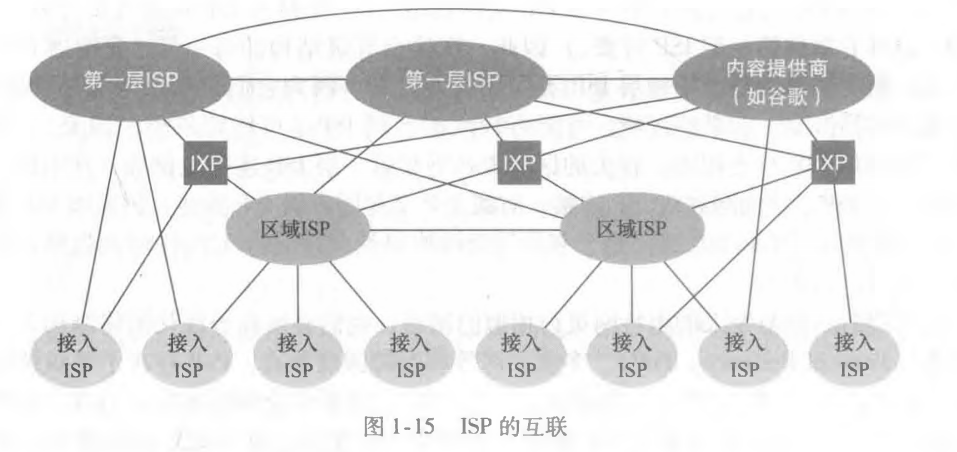

# 计算机网络概述

## 什么是Internet

### 从具体的构成角度

* 节点
  * 主机（端系统）及其上面运行的应用程序
  * 路由器，交换机等网络交换设备
* 通信链路
  * 接入网链路（类似你家路由器光猫连接到运营商路由节点）：主机连接的互联网的链路
  * 主干链路：路由器（交换机）间的链路
* 协议
  * 现在的网络架构（TCP/IP）模型分为五层，每层都有互相间约定的协议来交互

### 从服务描述的角度

* 即从为**应用程序提供服务的基础设施的角度**来描述因特网
* 因为这些应用程序涉及多个相互 交换数据的端系统，故它们被称为分布式应用程序
* 端系统一般是五层网络模型，路由器两层网络模型，交换机三层网络模型，最上层的应用程序进程依赖底层提供的服务来完成端系统应用进程到端系统应用进程的数据交互
* 应用程序可以部署到多个端系统上，也称为分布式应用程序，是根据基础设施向分布式应用程序提供的服务来描述

## 什么是协议

协议（protocol）定义了在两个或多个通信实体之间交换的报文的格式和顺 序，以及报文发送和/或接收一条报文或其他事件所采取的动作

因特网（更一般地说是计算机网络）广泛地使用了协议。不同的协议用于完成不同的 通信任务。

如果两个端系统的中的应用程序需要通信，就必须双方都按照一个协议（这里 HTTP协议）来交流

说人话就是：类比两个人交流需要一个共识的约定，A：你好，B：你好，A：现在几点了，B：凌晨3点

## 网络结构

### 网络边缘

* 主机（端系统）
* 应用程序（客户端和服务器）

我们从网络边缘开始，观察一下我们 更为熟悉的部件，即我们日常使用的计算机、智能手机和其他设备。

### 网络核心

* 互联着的路由器
* 网络的网络

即由互联因特网端系统的分组交换机和链路构成的网状网络。
排除网络边缘，通过路由器交换机链接编织的一张网络，称为网络核心。

数据怎样通过网络进行传输？

#### 电路交换（线路交换）

在电路交换网络中，在端系统间通信会话期间，预留了端系统间沿路径通信所需要的资源（缓存，链路传输速率）。

独享资源：不共享，如果呼叫没有数据发送，被分配的资源就会被浪费

通常被传统电话网络采用

.png)

网络资源（如带宽）被分成片

将带宽分成片 
* 频分(Frequencydivision multiplexing) 
* 时分(Time-division multiplexing) 
* 波分(Wave-division multiplexing)

电路交换不适合计算机之间，连接建立时间长， 计算机之间的通信有突发性，如果使用线路交换，则浪费的片较多，即使这个呼叫没有数据传递，其所占据的片也不能
够被别的呼叫使用， 可靠性不高？

#### 分组交换

以分组为单位存储-转发方式：

* 网络带宽资源不再分分为一个个片，传输时使用全部带宽
* 主机之间传输的数据被分为一个个分组

资源共享，按需使用：

* 存储-转发：分组每次移动一跳（ hop ）
  * 在转发之前，节点必须收到整个分组
  * 延迟比线路交换要大
  * 排队时间

排队时延和分组丢失：

* 每台分组交换机有多条链路与之相连。对于每条相连的链路，该分组交换机具有一个输出缓存（output buffer,也称为输出队列（output queue））

### 接入网，物理媒介

* 有线或者无限通信链路

#### 接入网

* 住宅的接入网络
* 单位接入网络
* 无线接入网络（4G,5G）

#### 物理媒介

* 双绞铜线
* 同轴电缆
* 光纤
* 陆地无线电信道
* 卫星无线电信道

### 网络的网络

公司的局域网链接到运营商的网络，这里的局域网可以称为营运商的网络的网络，地区的运营商（如之前的长城宽带）有需要接入更大的运营商网络，全国的
运营商网络又要接入到全球的网络中，这里一层层的网络嵌套就是网络的网络。

## 分组交换网中的时延、丢包和吞吐量

### 时延类型

* 节点处理时延(nodal processing delay)
* 排队时延(queuing delay)
* 传输时延(transmission delay)
* 传播时延(propagation delay)

### 丢包

在现实中，一条链路前的 队列只有有限的容量，尽管排队容量极大地依赖于路由器设计和成本。因为该排队容量是 有限的，随着流量强度接近1,排队时延并不真正趋向无穷大。相反，到达的分组将发现
一个满的队列。由于没有地方存储这个分组，路由器将丢弃(drop)该分组

### 吞吐量

.png)

## 协议层次及服务模型

什么要分层，一个复杂的系统通过分层来简化该系统的整体复杂度，拆分化整为零，底层服务项上层提供服务，下层服务器是上层应用的服务提供者。

* 五层因特网协议模型和七层ISO OSI 参考模型

.png)

* 封装与解封装

.png)

#### 服务和服务访问点

* 服务( Service)：低层实体向上层实体提供它们之间的通信的能力
  * 服务用户(service user)
  * 服务提供者(service provider )
* 原语(primitive)：上层使用下层服务的形式，高层使用低层提供的服务，以及低层向高层提供服务都是通过服务访问原语来进行交互的---形式
* 服务访问点 SAP (Services Access Point) ：上层使用下层提供的服务通过层间的接口—地点

#### 服务和协议

* 服务与协议的区别
  * 服务(Service)：低层实体向上层实体提供它们之间的通信的能力，是通过原语(primitive)来操作的，垂直
  * 协议(protocol) ：对等层实体(peer entity)之间在相互通信的过程中，需要遵循的规则的集合，水平

* 服务与协议的联系
  * 本层协议的实现要靠下层提供的服务来实现
  * 本层实体通过协议为上层提供更高级的服务

#### 各层次对所传输的数据叫法：

* 应用层：报文
* 传输层：报文段（传输协议分组）
* 网络层：数据报
* 数据链路层：帧
* 物理层：比特、光